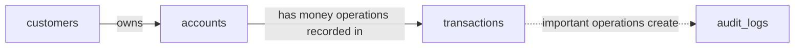

# 🏦 Banking Accounts API

[](https://nodejs.org/)
[](https://expressjs.com/)
[](https://www.postgresql.org/)
[](https://opensource.org/licenses/MIT)

> A simple REST API for managing customers, bank accounts, and money transfers.

A backend application built with **Node.js, Express.js, and PostgreSQL** that provides a basic banking system.

The API allows users to:

- 👤 Create and manage customers
- 💳 Create and manage bank accounts
- 💰 Deposit money
- 💸 Withdraw money
- 🔄 Transfer money between accounts
- 🧾 Store transaction history
- 📝 Create audit logs
- 🔒 Perform money operations using PostgreSQL transactions
- 🔐 Lock accounts during transfers to prevent race conditions and deadlocks

## ✨ Features

### 👤 Customers

- Create a customer
- Get a customer by ID
- Get all customers
- Update customer information
- Delete a customer

### 💳 Accounts

- Create a bank account
- Get account information
- Change account status
- **Supported currencies:** `AMD`, `USD`, `EUR`
- **Supported statuses:** `active`, `frozen`, `closed`

### 💰 Money Operations

- **Deposit:** Add money to an account
- **Withdraw:** Withdraw money from an account
- **Transfer:** Transfer money safely between two accounts

## 🛠️ Tech Stack

| Technology | Purpose |
| --- | --- |
| Node.js | JavaScript runtime |
| Express.js | REST API framework |
| PostgreSQL | Relational database |
| `pg` | PostgreSQL client for Node.js |
| `dotenv` | Environment variable management |
| Postman | API testing |

## 📁 Project Structure

```text
src/
├── config/
│   ├── database.js
│   └── env.js
├── controllers/
│   ├── customers.controller.js
│   ├── accounts.controller.js
│   └── transfers.controller.js
├── models/
│   ├── customers.model.js
│   └── accounts.model.js
├── routes/
│   ├── customers.route.js
│   ├── accounts.route.js
│   └── transfers.route.js
├── services/
│   ├── customers.service.js
│   └── accounts.service.js
├── db/
│   └── schema.sql
├── app.js
└── server.js
```

The project follows a simple layered architecture:

```text
Route → Controller → Service → Model → PostgreSQL
```

## 🚀 Installation

Clone the repository:

```bash
git clone <your-repository-url>
cd banking-accounts-api
```

Install dependencies:

```bash
npm install
```

## 🐘 Database Setup

Make sure PostgreSQL is installed and running.

Check the PostgreSQL version:

```bash
psql --version
```

Connect to PostgreSQL:

```bash
psql -U postgres
```

### 1. Create the database

```sql
CREATE DATABASE banking_account;
```

Connect to the database:

```text
\c banking_account
```

### 2. Import the schema

The project includes the complete database schema in [`src/db/schema.sql`](src/db/schema.sql).

From the PostgreSQL terminal, run:

```text
\i src/db/schema.sql
```

Check the created tables:

```text
\dt
```

You should see:

- `accounts`
- `audit_logs`
- `customers`
- `transactions`

## 🗄️ Database Schema

### Entity Relationship Diagram



### Main Tables

- **`customers`** — Stores customer information.
- **`accounts`** — Stores bank accounts, balances, currencies, and account statuses.
- **`transactions`** — Stores all money operations: deposits, withdrawals, and transfers.
- **`audit_logs`** — Stores an audit trail for important account operations.

## 🔐 Environment Variables

Create a `.env` file in the project root:

```dotenv
PORT=3000

DB_HOST=localhost
DB_PORT=5432
DB_USER=postgres
DB_PASSWORD=your_password

DB_NAME=banking_account
DB_DEFAULT_NAME=postgres
```

Never commit your `.env` file to GitHub. Add it and `node_modules/` to `.gitignore`:

```gitignore
node_modules/
.env
```

## 🛡️ Transaction Safety

Money operations are implemented using PostgreSQL transactions:

```text
BEGIN
  ↓
Validate accounts
  ↓
Lock accounts
  ↓
Update balances
  ↓
Create transaction record
  ↓
Create audit log
  ↓
COMMIT
```

If an error occurs, the transaction is rolled back:

```sql
ROLLBACK;
```

This ensures that a transfer cannot partially complete.

For transfers, accounts are locked in a consistent order using:

```sql
ORDER BY id
FOR UPDATE
```

This helps prevent deadlocks when multiple transfers happen simultaneously.

## 📡 API Endpoints

### 👤 Customers

| Method | Endpoint | Description |
| --- | --- | --- |
| `POST` | `/api/customers` | Create customer |
| `GET` | `/api/customers` | Get all customers |
| `GET` | `/api/customers/:id` | Get customer |
| `PATCH` | `/api/customers/:id` | Update customer |
| `DELETE` | `/api/customers/:id` | Delete customer |

### 💳 Accounts

| Method | Endpoint | Description |
| --- | --- | --- |
| `POST` | `/api/accounts` | Create account |
| `GET` | `/api/accounts/:id` | Get account |
| `PATCH` | `/api/accounts/:id/status` | Change account status |

### 💰 Money Operations

| Method | Endpoint | Description |
| --- | --- | --- |
| `POST` | `/api/accounts/:id/deposit` | Deposit money |
| `POST` | `/api/accounts/:id/withdraw` | Withdraw money |
| `POST` | `/api/transfers` | Transfer money |

## 💵 Example Requests

### Create Customer

```http
POST /api/customers
Content-Type: application/json

{
  "full_name": "John Doe",
  "email": "john@example.com",
  "phone": "+37499123456"
}
```

### Create Account

```http
POST /api/accounts
Content-Type: application/json

{
  "customer_id": 1,
  "currency": "AMD"
}
```

### Deposit

```http
POST /api/accounts/1/deposit
Content-Type: application/json

{
  "amount": 10000,
  "reference": "DEP-001",
  "note": "Initial deposit"
}
```

### Withdraw

```http
POST /api/accounts/1/withdraw
Content-Type: application/json

{
  "amount": 3000,
  "reference": "WD-001",
  "note": "Cash withdrawal"
}
```

### Transfer

```http
POST /api/transfers
Content-Type: application/json

{
  "fromId": 1,
  "toId": 2,
  "amount": 5000,
  "reference": "TR-001",
  "note": "Transfer between accounts"
}
```

## ▶️ Running the Application

Start the server:

```bash
npm start
```

Or start it in development mode with auto-reload:

```bash
npm run dev
```

The server will be available at <http://localhost:3000>.

## 🧪 Testing

The API can be tested using Postman.

Recommended testing flow:

1. Create a customer
2. Create two accounts
3. Deposit money
4. Test withdrawal
5. Test transfer
6. Test error cases

Important error cases to test:

- Insufficient balance
- Nonexistent account
- Frozen account
- Closed account
- Same sender and receiver
- Duplicate transaction reference
- Negative amount
- Zero amount

## 📝 Audit Logs

Important money operations create records in the `audit_logs` table.

Example:

```json
{
  "action": "ACCOUNT_TRANSFER",
  "meta": {
    "from_account_id": 1,
    "to_account_id": 2,
    "amount": 5000,
    "reference": "TR-001"
  }
}
```

This provides a basic audit trail for financial operations.

## ❌ Error Handling

The API returns errors as JSON.

Example:

```json
{
  "error": "Insufficient balance"
}
```

Instead of returning Express's default HTML error page, the application uses centralized error-handling middleware.

## 🔒 Data Integrity

The database uses PostgreSQL constraints to protect data integrity:

- `PRIMARY KEY`
- `FOREIGN KEY`
- `UNIQUE`
- `NOT NULL`
- `CHECK`

Money operations use:

- PostgreSQL transactions
- `COMMIT`
- `ROLLBACK`
- `FOR UPDATE` row locking

## 🚧 Future Improvements

- [ ] Authentication and authorization
- [ ] JWT-based authentication
- [ ] Input validation library
- [ ] Custom error classes
- [ ] Pagination
- [ ] Swagger / OpenAPI documentation
- [ ] Automated tests
- [ ] Docker setup
- [ ] Rate limiting
- [ ] Request logging
- [ ] Currency conversion
- [ ] User roles and permissions

## 👨‍💻 Author

**Gor Afyan**

Software Engineering Student | Armenia

## 📄 License

This project is open-source and available under the MIT License.

⭐ If you find this project useful, feel free to give it a star!